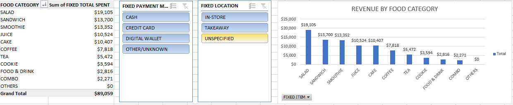

# SALES-DATA-CLEANING-PROJECT
# Sales Data Cleaning & Interactive Dashboard

## 1. The Problem
The project started with a raw dataset of *10,000 sales records* that contained significant inconsistencies. Item names (e.g., "S-wich" vs "Sandwich"), payment methods, and locations were not standardized, making it impossible to generate accurate financial reports.

## 2. The Solution (What I Did)
* *Data Cleaning*: Standardized 10,000 rows of data by fixing typos and categorizing items using Excel formulas and Find/Replace.
* *Data Transformation*: Organized the cleaned data into Pivot Tables to summarize total spending per category.
* *Dashboard Creation: Built an interactive dashboard using **PivotCharts* and *Slicers* for Payment Methods and Locations.

## 3. The Result
The final dashboard provides a clean, interactive view of *$89,059.00* in total revenue. It identifies *Salad* as the top-selling category at *$19,105.00* and allows stakeholders to filter data by payment type or store location instantly.

